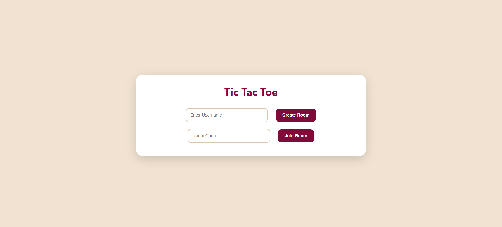
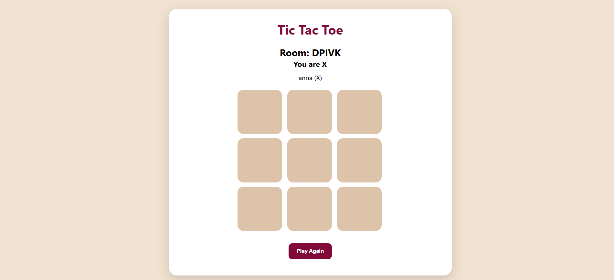
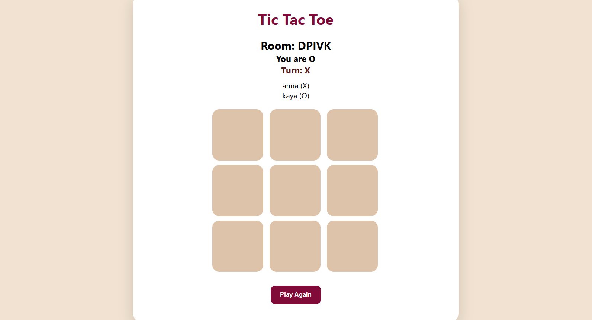
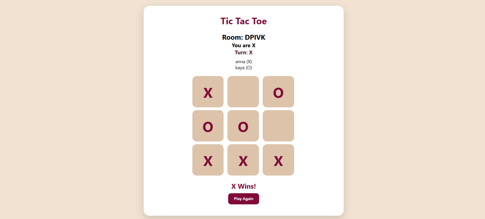

# 🎮 Tic-Tac-Toe-Game

A real-time multiplayer Tic-Tac-Toe web application built using **Node.js**, **Express.js**, and **Socket.IO**. Players can create private rooms, join using a room code, and play against each other in real time.

---

## 🌐 Live Demo

🔗 https://tic-tac-toe-game-zpkl.onrender.com

> **Note:** This application is hosted on Render's free plan. If the app has been inactive for a while, it may take 30–60 seconds to wake up on the first visit.

---

## 📌 Features

- ✅ Create a private game room
- ✅ Join a room using a room code
- ✅ Real-time multiplayer gameplay
- ✅ Automatic X and O assignment
- ✅ Live board synchronization using Socket.IO
- ✅ Win detection
- ✅ Draw detection
- ✅ Play Again functionality
- ✅ Responsive and modern UI
- ✅ Deployed online using Render

---

## 🛠️ Tech Stack

### Frontend
- HTML5
- CSS3
- JavaScript

### Backend
- Node.js
- Express.js
- Socket.IO

### Deployment
- Render
- GitHub

---

## 📂 Project Structure

```
Tic-Tac-Toe-Game
│
├── public
│   ├── index.html
│   ├── style.css
│   └── script.js
│
├── server.js
├── package.json
├── package-lock.json
├── .gitignore
└── README.md
```

---

## 🚀 Running the Project Locally

### 1. Clone the repository

```bash
git clone https://github.com/AnanyaKayal27/Tic-Tac-Toe-Game.git
```

### 2. Navigate to the project folder

```bash
cd Tic-Tac-Toe-Game
```

### 3. Install dependencies

```bash
npm install
```

### 4. Start the server

```bash
node server.js
```

### 5. Open your browser

```
http://localhost:3000
```

---

## 🎮 How to Play

1. Enter your username.
2. Click **Create Room** to generate a new room.
3. Share the room code with another player.
4. The second player enters the room code and clicks **Join Room**.
5. Play Tic-Tac-Toe in real time.
6. Click **Play Again** after the game ends to start another round.

---

## 📸 Screenshots

### Login Page

Players enter their username and choose to create or join a room.



### Waiting Room

The room creator waits for the second player to join using the room code.



### Gameplay

Real-time multiplayer gameplay powered by Socket.IO.



### Winner Screen

The game announces the winner and allows players to start another round.



## 👨‍💻 Author

**Ananya Kayal**

GitHub: https://github.com/AnanyaKayal27

---

## 📄 License

This project is developed for educational and learning purposes.